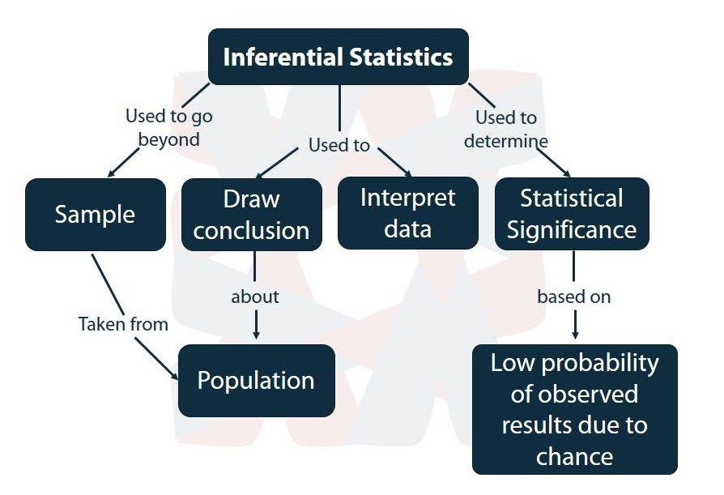

```{r setup, include=FALSE}
knitr::opts_chunk$set(echo = TRUE)
```

<center> <h1> <b> Conclusiones del modelo inferencial </b> </h1> </center>

<span style="padding-left:5px">

+ El modelo es útil para entender a fondo un problema de alta relevancia social.
+ La selección del mejor modelo logit a través del algoritmo de selección genético ha sido útil para determinar qué variables afectan a la probabilidad de reprobar.

<span style="padding-left:5px">
<center></center>

<span style="padding-left:5px">

<center> <h1> <b> Recomedaciones y oportunidades de mejora </b> </h1> </center>

<span style="padding-left:5px">

+ Realizar análisis de políticas relacionadas tanto a la situación del estudiante (e.g. política de cuotas) como al manejo del curso de nivelación (e.g. jornadas), que permitan obtener mejores resultados en la aprobación del mismo.
+ Estimar nuevos modelos de inferencia:

  + Incluir variables sociodemográficas adicionales que ya están siendo recogidas.
  + Profesores por rangos de edades y desempeño. Información sensible.
  + Análisis más amplio para validación de expertos.

<span style="padding-left:5px">

<center></center>

<span style="padding-left:5px">