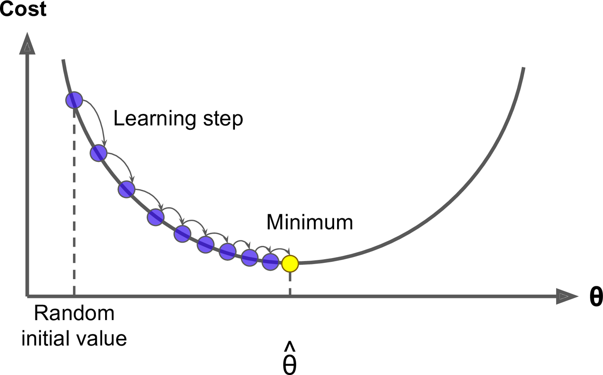

```{r setup, include=FALSE}
knitr::opts_chunk$set(echo = TRUE)
```

<center> <h1> <b> Modelo predictivo: Gradient Boosting Machine </b> </h1> </center>

<span style="padding-left:15px">

+ **Gradient Boosting Machine (GBM)** es uno de los más famosos algoritmos de aprendizaje automático.
+ Método líder para ganar competencias en [Kaggle](https://www.kaggle.com/).
+ Mientras un bosque aleatorio crea un **ensamble** de árboles profundos independientes, el GBM crea uno de árboles débiles sucesivos que aprenden de estimaciones anteriores. Al unirlos se crea un modelo poderoso.
+ En cada iteración en particular, se entrena un nuevo modelo de base débil de aprendizaje con respecto al error de todo el conjunto aprendido hasta ahora.

<span style="padding-left:5px">

<center></center>

<span style="padding-left:5px">

<center></center>

<span style="padding-left:5px">

<div class="definition_box">
<i><b>Modelos de aprendizaje base:</b> Boosting es un algoritmo que mejora iterativamente cualquier modelo de aprendizaje débil. En la práctica, los algoritmos boosting casi siempre usan árboles de decisión como modelo de aprendizaje base.</i>
</div>

<div class="definition_box">
<i><b>Entrenamiento de modelos débiles:</b> Un modelo débil es aquel cuya tasa de error es solo un poco mejor que adivinar al azar. La idea detrás del boosting es que cada modelo secuencial crea un modelo débil simple para mejorar ligeramente los errores restantes.  La combinación de muchos modelos débiles (versus los fuertes) tiene algunos beneficios: Velocidad, mejora de precisión, evita el sobreajuste (validación cruzada).</i>
</div>

<center> <h1> <b> Algoritmo de descenso del gradiente </b> </h1> </center>

<span style="padding-left:5px">

+ Minimización de los residuos (función de pérdida de MS).
+ El algoritmo de descenso del gradiente minimiza la función de pérdida de error cuadrático medio (MSE).
+ Otras funciones de pérdida como el error absoluto medio (MAE) y la función de pérdida basada en la desviación para un problema de clasificación.
+ El nombre del modelo Gradient Boosting Machine (GBM), viene del hecho de que este procedimiento puede generalizarse a funciones de pérdida distintas de MSE.
+ El descenso de gradiente es un algoritmo de optimización muy genérico capaz de encontrar soluciones óptimas para una amplia gama de problemas.
+ La idea general del descenso de gradiente es ajustar los parámetros de forma iterativa para minimizar una función de costo.

<span style="padding-left:5px">

<center></center>

<span style="padding-left:5px">

<center></center>

<span style="padding-left:5px">

<center> <h1> <b> Ventajas y desventajas del uso de GBM </b> </h1> </center>

<span style="padding-left:5px">

**Ventajas:**

<span style="padding-left:5px">

+ El algoritmo proporciona una buena precisión predictiva.
+ Mucha flexibilidad: se puede optimizar las diferentes funciones de pérdida y los hiperparámetros para que la función se ajuste de mejor forma.
+ No se requiere procesamiento previo de datos: a menudo funciona muy bien con valores categóricos y numéricos tal como están.
+ Maneja datos faltantes: no se requiere imputación. Es recomendado en bases de datos con datos atípicos.

<span style="padding-left:5px">

<center></center>

<span style="padding-left:5px">

**Desventajas:**

<span style="padding-left:5px">

+ El algoritmo GB continuará mejorando para minimizar todos los errores. Esto puede enfatizar a los valores atípicos y causar un sobreajuste. Se incorporó validación cruzada para neutralizar esta desventaja.
+ Computacionalmente caro: el algoritmo GB a menudo requiere muchos árboles (> 1000) que pueden ser exhaustivos en tiempo y memoria.
+ La alta flexibilidad da como resultado muchos parámetros que interactúan e influyen fuertemente en el comportamiento del enfoque (número de iteraciones, profundidad del árbol, parámetros de regularización, etc.). Esto requiere una búsqueda exhaustiva durante el ajuste.
+ No es intuitivamente interpretable, para lo cual ajustaremos otro modelo para este objetivo.
+ Existen otras implementaciones del algoritmo, como **XGBoost** o "Extreme Gradiente Boosting", que es una implementación eficiente de modelos GBM (aproximadamente 10 veces más rápido).

<span style="padding-left:5px">

<center></center>

<span style="padding-left:5px">

Más información aquí: http://uc-r.github.io/gbm_regression